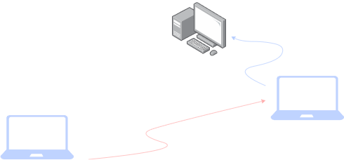
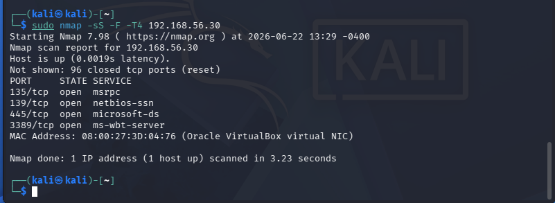
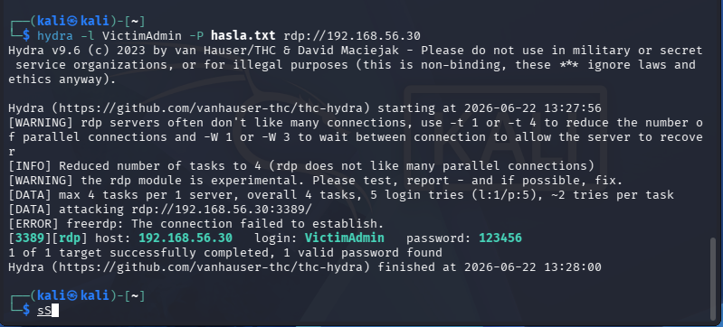
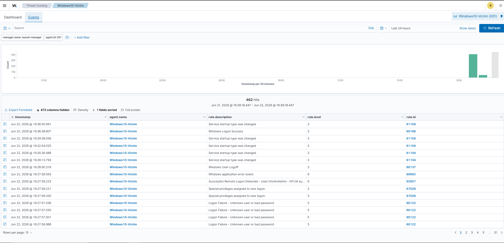
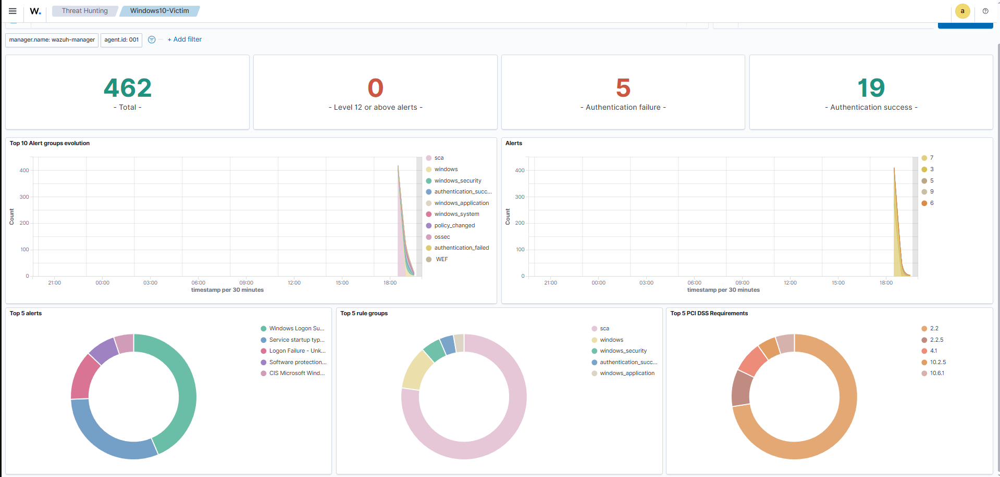
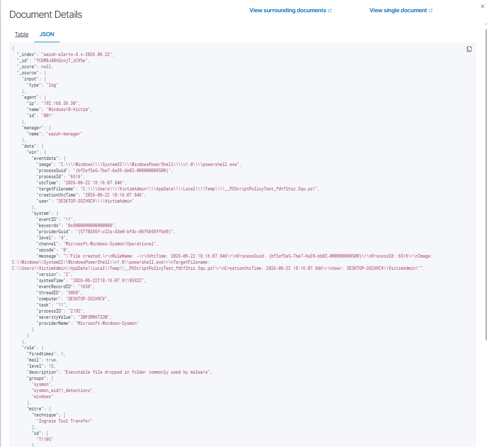
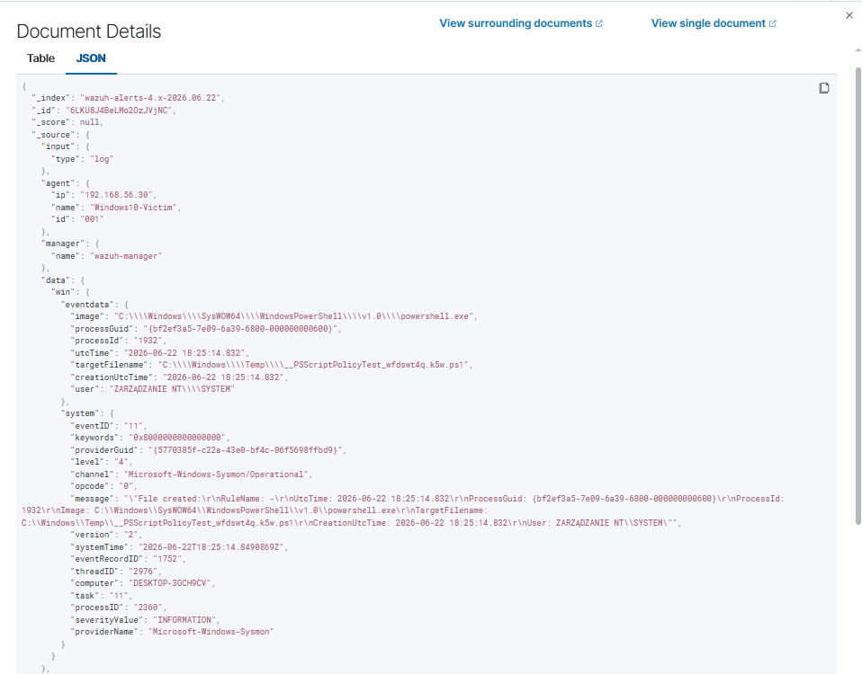
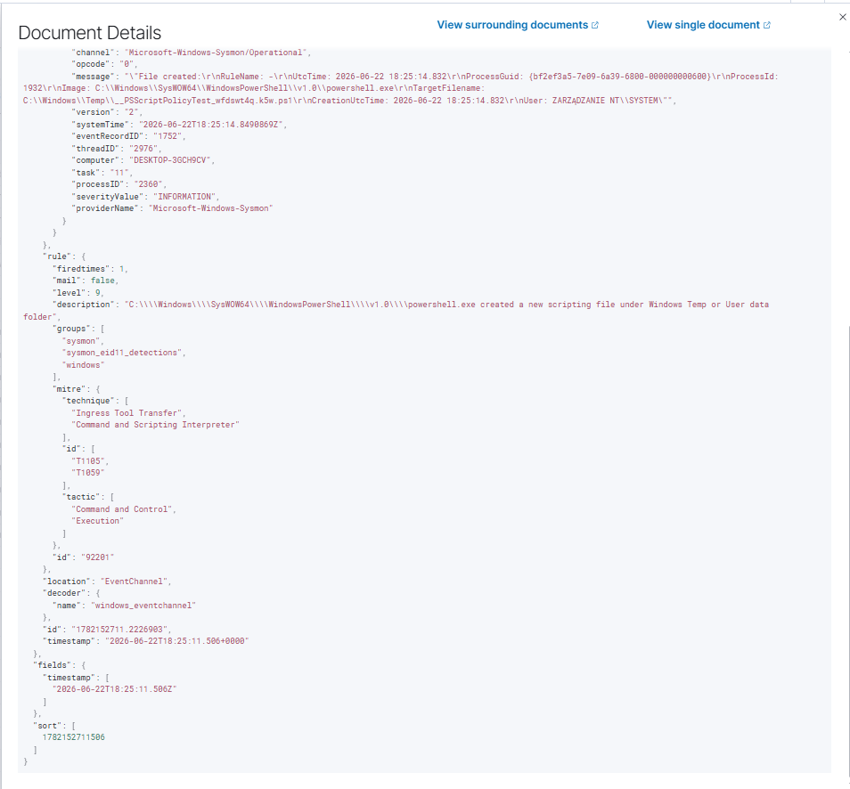
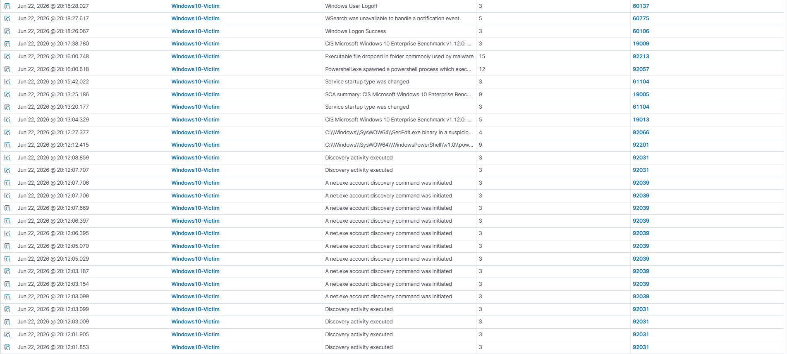

# 🛡️ Home Lab SOC — Wykrywanie Ataków z Wazuh SIEM

> Mini-SOC zbudowany od zera w VirtualBox: symulacja ataku end-to-end (rekonesans → brute-force → próba dostawy malware → Living off the Land) wykryta i przeanalizowana w Wazuh SIEM, z mapowaniem na MITRE ATT&CK.

---

## 📋 Spis treści

- [O projekcie](#o-projekcie)
- [Architektura](#architektura)
- [Stack technologiczny](#stack-technologiczny)
- [Przebieg ataku i detekcji (Attack Chain)](#przebieg-ataku-i-detekcji-attack-chain)
- [Napotkane problemy i ich rozwiązanie](#napotkane-problemy-i-ich-rozwiązanie)
- [Mapowanie MITRE ATT&CK](#mapowanie-mitre-attck)
- [Czego się nauczyłem](#czego-się-nauczyłem)
- [Jak odtworzyć projekt](#jak-odtworzyć-projekt)

---

## 🎯 O projekcie

Celem projektu było zbudowanie kompletnego, izolowanego środowiska Security Operations Center (SOC) i przejście przez cały cykl pracy analityka: od konfiguracji SIEM, przez emulację realnych technik atakującego, aż po analizę wygenerowanych alertów i ich powiązanie z frameworkiem MITRE ATT&CK.

Środowisko jest w pełni izolowane (VirtualBox Host-Only Network, brak dostępu z zewnątrz) - wszystkie hasła, payloady i ataki użyte w tym projekcie służą wyłącznie do celów edukacyjnych w kontrolowanym labie.

---

## 🏗️ Architektura

Sieć izolowana **Host-Only** w Oracle VirtualBox, podsieć `192.168.56.0/24`:

| Rola | System | Adres IP | Opis |
|---|---|---|---|
| 🔴 Atakujący | Kali Linux | `192.168.56.10` | Nmap, Hydra, Metasploit (msfvenom) |
| 🔵 SIEM | Ubuntu Server 22.04 LTS + Wazuh Manager v4.9.2 | `192.168.56.20` | Indexer + Server + Dashboard (all-in-one) |
| 🟢 Ofiara | Windows 10 Enterprise + Wazuh Agent + Sysmon | `192.168.56.30` | Generuje telemetrię (Event Log + Sysmon) |



## 🧰 Stack technologiczny

- **Wazuh 4.9.2** - open-source SIEM/XDR: zbiera logi, koreluje zdarzenia, generuje alerty i mapuje je na MITRE ATT&CK
- **Ubuntu Server 22.04 LTS** - system hostujący Wazuh Manager
- **Windows 10 Enterprise** - maszyna generująca telemetrię
- **Sysmon (Microsoft Sysinternals)** - szczegółowe logowanie procesów, połączeń sieciowych i operacji na plikach
- **Kali Linux** - Nmap, Hydra, Metasploit/msfvenom — narzędzia ofensywne
- **VirtualBox** - wirtualizacja, sieć Host-Only do izolacji środowiska

---

## ⚔️ Przebieg ataku i detekcji (Attack Chain)

### Faza A - Rekonesans i dostęp początkowy

**1. Network Service Discovery - [`T1046`](https://attack.mitre.org/techniques/T1046/)**

Skanowanie portów z Kali w celu zidentyfikowania aktywnych usług na maszynie ofiary:

```bash
sudo nmap -sS -F -T4 192.168.56.30
```

> `-sS` - SYN scan (skan "półotwarty", szybszy i mniej "głośny" niż pełne połączenie TCP) · `-F` - skanuje tylko najpopularniejsze porty z mniejszej listy (fast scan) · `-T4` - agresywny tryb czasowy (szybsze skanowanie)

Wynik: wykryto otwarte porty **135 (MSRPC), 139 (NetBIOS), 445 (SMB), 3389 (RDP)**.



---

**2. Brute Force: Remote Services - [`T1110.002`](https://attack.mitre.org/techniques/T1110/002/)**

Atak słownikowy na konto `VictimAdmin` po protokole RDP:

```bash
hydra -l VictimAdmin -P hasla.txt rdp://192.168.56.30
```

> `-l` - pojedynczy login do testowania · `-P` - ścieżka do pliku ze słownikiem haseł · `rdp://` - protokół docelowy

Hasło zostało złamane (`123456` - klasyczny przykład słabego hasła, świadomie użyty w tym kontrolowanym teście).



**🔍 Detekcja w Wazuh:** Wazuh zarejestrował wysoką liczbę zdarzeń **Event ID 4625** (nieudane logowanie) bezpośrednio przed jednym **Event ID 4624** (udane logowanie) - klasyczny, łatwo rozpoznawalny wzorzec brute-force. Dashboard pokazuje wyraźny skok aktywności (462 zdarzenia w ciągu doby, w tym 5 nieudanych i 19 udanych uwierzytelnień w widocznym oknie czasowym).





---

### Faza B - Próba dostawy narzędzia (Ingress Tool Transfer) - [`T1105`](https://attack.mitre.org/techniques/T1105/)

1. Wygenerowano 64-bitowy payload Meterpreter Reverse TCP (`update.exe`) za pomocą `msfvenom` na Kali.
2. Payload został wystawiony przez prosty serwer HTTP:
   ```bash
   python3 -m http.server 80
   ```
   > `-m http.server` - wbudowany w Pythona moduł uruchamiający lekki serwer HTTP, serwujący pliki z aktualnego katalogu
3. Na maszynie Windows pobrano i uruchomiono plik.

**💥 Rzeczywistość obronna:** Windows Defender **zablokował i usunął `update.exe` natychmiast** po jego utworzeniu na dysku. To zapobiegło uzyskaniu działającej sesji Meterpreter (brak Sysmon Event ID 1 dla `update.exe`) - **ale jest to dokładnie taki wynik, jakiego oczekuje się w środowisku z aktywną ochroną antywirusową**. Sam fakt zapisania pliku na dysku wygenerował **Sysmon Event ID 11 (File Create)**, co Wazuh poprawnie oznaczył jako alert **„Executable file dropped in folder commonly used by malware"**.



---

### Faza C - Living off the Land & Defense Evasion - [`T1059.001`](https://attack.mitre.org/techniques/T1059/001/)

Aby ominąć blokadę binarki i jednocześnie wygenerować wiarygodną telemetrię wykonania (bez użycia realnego malware), zastosowano technikę **Living off the Land** - wykorzystanie legalnego narzędzia systemowego (PowerShell) do podejrzanej aktywności.

Z uprawnieniami administratora wykonano silnie zaciemnioną komendę PowerShell, zakodowaną w Base64:

```powershell
powershell.exe -ExecutionPolicy Bypass -WindowStyle Hidden -EncodedCommand VwByAGkAdABlAC0ASABvAHMAdAAgACIAVABlAHMAdAAgAFMAbwBDAAIAIgA=
```

> `-ExecutionPolicy Bypass` - ignoruje domyślne restrykcje PowerShell blokujące wykonywanie skryptów · `-WindowStyle Hidden` - uruchamia proces bez widocznego okna · `-EncodedCommand` - przyjmuje komendę zakodowaną w Base64 (popularna technika obfuskacji używana do unikania prostej detekcji opartej na słowach kluczowych)

**🔍 Detekcja w Wazuh:** Ten pojedynczy krok wygenerował serię alertów na poziomie **9 i 15** (wysoki priorytet) - w tym:
- `PowerShell.exe spawned a powershell process which exec...` (poziom 12)
- `C:\...\powershell.exe created a new scripting file under Windows Temp or User data folder` (poziom 9)
- `Executable file dropped in folder commonly used by malware` (poziom 15)

Telemetria Sysmon Event ID 11 (File Create) zarejestrowała moment utworzenia pliku skryptowego przez powershell.exe w katalogu Temp, co widać w surowym dokumencie JSON zindeksowanym przez Wazuh:





Wazuh automatycznie zmapował to zdarzenie na **dwie techniki MITRE ATT&CK jednocześnie**: `T1105` (Ingress Tool Transfer) i `T1059` (Command and Scripting Interpreter), w taktykach *Command and Control* oraz *Execution* - widoczne bezpośrednio w polu `rule.mitre` zdarzenia.

Dodatkowo zaobserwowano aktywność rozpoznawczą (`Discovery activity executed`, `A net.exe account discovery command was initiated`) - naturalny kolejny krok atakującego po uzyskaniu dostępu, polegający na enumeracji kont i uprawnień w systemie.



---

## 🔧 Napotkane problemy i ich rozwiązanie

Praca w realnym SOC to w dużej mierze utrzymanie infrastruktury logującej w działaniu. Poniżej dwa problemy, które napotkałem i rozwiązałem:

### 1. Niestabilne połączenie agenta Wazuh

**Problem:** przy ograniczeniu 2 GB RAM na maszynie Windows usługa `WazuhSvc` regularnie się zawieszała lub przechodziła w stan rozłączony, przerywając przepływ telemetrii do managera.

**Rozwiązanie:** zdiagnozowane przez monitoring statusu agenta w dashboardzie Wazuh (zdarzenia „Wazuh agent stopped" / „Wazuh agent started" widoczne w logach), naprawione poprzez ręczny restart usługi z uprawnieniami administratora:

```powershell
Restart-Service WazuhSvc -Force
```

> `Restart-Service` - cmdlet PowerShell zatrzymujący i ponownie uruchamiający wskazaną usługę Windows · `-Force` - wymusza restart nawet jeśli usługa ma zależne procesy

### 2. Brak domyślnej integracji z logami Sysmon

**Problem:** domyślna konfiguracja agenta Wazuh **nie zbiera** logów Sysmon - Wazuh i Sysmon piszą do oddzielnych kanałów zdarzeń, które trzeba ręcznie połączyć.

**Rozwiązanie:** edycja pliku konfiguracyjnego agenta `C:\Program Files (x86)\ossec-agent\ossec.conf`, dodanie sekcji wskazującej na kanał zdarzeń Sysmon:

```xml
<localfile>
  <location>Microsoft-Windows-Sysmon/Operational</location>
  <log_format>eventchannel</log_format>
</localfile>
```

> `<localfile>` - blok konfiguracyjny Wazuh definiujący dodatkowe źródło logów · `eventchannel` = format wskazujący, że źródłem jest kanał zdarzeń Windows (Event Log), nie plik tekstowy

Po restarcie usługi agenta, zdarzenia Sysmon (Event ID 1, 3, 11) zaczęły poprawnie trafiać do Wazuh Managera, co umożliwiło detekcję opisaną w Fazie B i C.

---

## 🗺️ Mapowanie MITRE ATT&CK

| Faza ataku | Technika | ID MITRE | Taktyka | Status detekcji |
|---|---|---|---|---|
| Rekonesans | Network Service Discovery | `T1046` | Discovery | ✅ Wykryty (skan portów) |
| Dostęp początkowy | Brute Force: Remote Services | `T1110.002` | Credential Access | ✅ Wykryty (Event ID 4625/4624) |
| Dostawa narzędzia | Ingress Tool Transfer | `T1105` | Command and Control | ✅ Wykryty (Sysmon Event ID 11 + FIM) |
| Wykonanie | Command and Scripting Interpreter | `T1059.001` | Execution | ✅ Wykryty (alert poziom 9-15, na bazie Sysmon Event ID 11) |
| Rozpoznanie po dostępie | Account Discovery | `T1087` | Discovery | ✅ Wykryty (`net.exe account discovery`) |
| Obrona przed AV | Defense Evasion (próba) | — | Defense Evasion | ⚠️ Zablokowane przez Windows Defender |

---

## 💡 Czego się nauczyłem

- Konfiguracja i administracja SIEM (Wazuh) od zera - instalacja, agentowanie, dashboardy.
- Integracja Sysmon z Wazuh poprzez ręczną edycję `ossec.conf` - domyślna konfiguracja **nie** obejmuje tego automatycznie.
- Rozpoznawanie wzorców ataku w logach (np. seria 4625 → 4624 jako sygnatura brute-force).
- Praktyczne zrozumienie, czym jest technika Living off the Land i czemu generuje ona telemetrię trudniejszą do odróżnienia od normalnej administracji systemem.
- Mapowanie zdarzeń SIEM na MITRE ATT&CK - i że jedno zdarzenie może odpowiadać kilku technikom jednocześnie.
- Diagnozowanie i naprawa niestabilności agenta w warunkach ograniczonych zasobów (realne ograniczenie RAM, nie tylko teoria).
- Że "atak nieudany" (zablokowany przez Defender) wciąż generuje wartościową telemetrię i jest pełnoprawnym materiałem do analizy SOC.

---

## 🔁 Jak odtworzyć projekt

1. Utwórz sieć Host-Only w VirtualBox (`192.168.56.0/24`).
2. Zainstaluj trzy maszyny wirtualne: Ubuntu Server (Wazuh Manager), Windows 10 (ofiara z Sysmon), Kali Linux (atakujący) - zgodnie z adresacją z sekcji [Architektura](#-architektura).
3. Zainstaluj Wazuh (all-in-one): `curl -sO https://packages.wazuh.com/4.9/wazuh-install.sh && sudo bash ./wazuh-install.sh -a`
4. Zainstaluj Sysmon (konfiguracja SwiftOnSecurity) i Wazuh Agent na Windows.
5. Dodaj integrację Sysmon → Wazuh w `ossec.conf` (patrz sekcja [Napotkane problemy](#-napotkane-problemy-i-ich-rozwiązanie)).
6. Powtórz scenariusze ataku z sekcji [Attack Chain](#-przebieg-ataku-i-detekcji-attack-chain).

---

*Projekt edukacyjny zrealizowany w pełni izolowanym środowisku homelab. Wszystkie techniki ofensywne użyte wyłącznie na własnej infrastrukturze testowej.*

